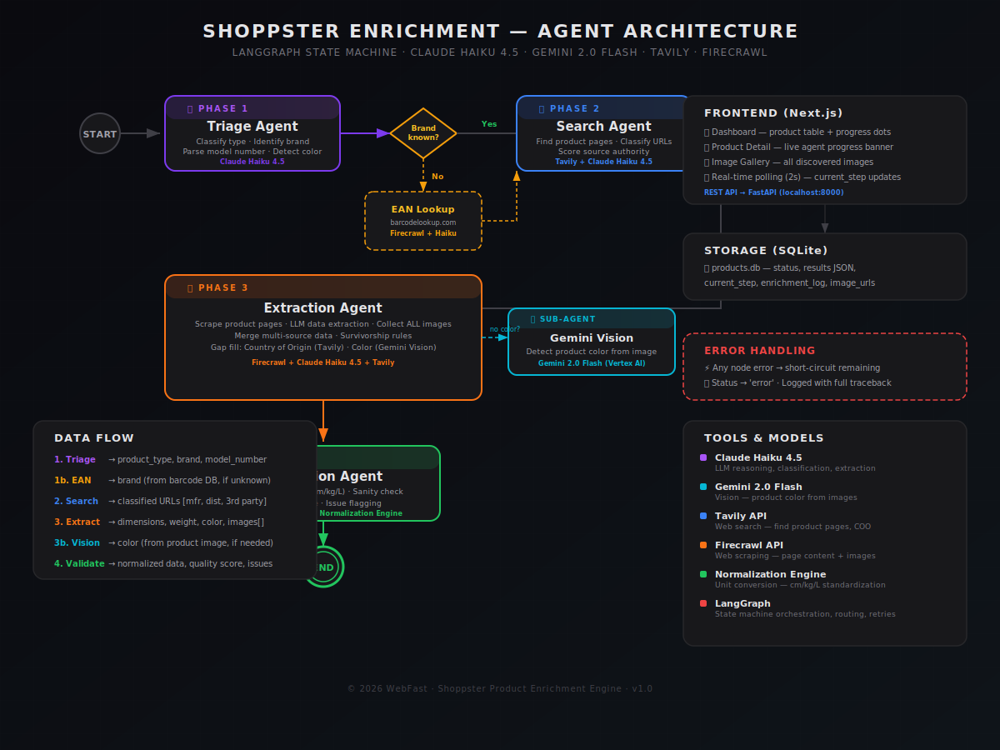

# Product Data Enrichment Engine

AI-powered product data enrichment pipeline built with **LangGraph** for orchestration, **Claude Haiku 4.5** for reasoning, **Tavily** for web search, and **Firecrawl** for web scraping.

Takes incomplete product data (EAN, name) and enriches it with dimensions, weight, color, country of origin, and images from authoritative web sources — manufacturer sites first, distributors as fallback.

## Architecture



### Pipeline Agents

| Agent | Model | Role | Tools |
|-------|-------|------|-------|
| **Triage** | Haiku 4.5 | Classify product type, identify brand, parse name | Claude structured output |
| **EAN Lookup** | Haiku 4.5 | Find brand from barcode database (conditional) | Firecrawl scrape |
| **Search** | Haiku 4.5 | Find product pages, classify URLs by source type | Tavily search, Claude |
| **Extract** | Haiku 4.5 | Scrape pages, extract structured data, collect ALL images, fill gaps | Firecrawl, Claude |
| **Gemini Vision** | Gemini 2.0 Flash | Detect product color from image (sub-agent, fires if text extraction fails) | Vertex AI Vision |
| **Validate** | Haiku 4.5 | Normalize units, sanity check, quality scoring | Claude, normalization engine |

## Prerequisites

- **Node.js** 18+ and npm
- **Python** 3.11+
- **Google Cloud** project with Vertex AI API enabled
- **API Keys** for Tavily and Firecrawl

## Credentials Setup

### 1. Google Cloud (Vertex AI — for Claude)

1. Create a Google Cloud project or use an existing one
2. Enable the **Vertex AI API** in the Google Cloud Console
3. Enable **Claude models** via the Vertex AI Model Garden (search for "Claude")
4. Create a **service account** with the Vertex AI User role
5. Download the service account JSON key file
6. Place it in the `backend/` directory

```bash
# Set in backend/.env
VERTEX_PROJECT_ID=your-gcp-project-id
VERTEX_LOCATION=us-east5
GOOGLE_APPLICATION_CREDENTIALS=path/to/your-service-account.json
```

> **Note:** `us-east5` is the primary region for Claude on Vertex AI. Check [Google's docs](https://cloud.google.com/vertex-ai/generative-ai/docs/partner-models/use-claude) for current availability.

### 2. Tavily (Web Search)

1. Sign up at [tavily.com](https://tavily.com)
2. Get your API key from the dashboard
3. Free tier: 1,000 searches/month

```bash
TAVILY_API_KEY=tvly-your-key-here
```

### 3. Firecrawl (Web Scraping)

1. Sign up at [firecrawl.dev](https://www.firecrawl.dev)
2. Get your API key from the dashboard
3. Free tier: 500 credits

```bash
FIRECRAWL_API_KEY=fc-your-key-here
```

## Installation

### Backend

```bash
cd backend

# Create virtual environment
python -m venv venv

# Activate it
# Windows:
venv\Scripts\activate
# macOS/Linux:
source venv/bin/activate

# Install dependencies
pip install -r requirements.txt

# Copy env template and fill in your credentials
cp .env.example .env
# Edit .env with your API keys
```

### Frontend

```bash
# From project root
npm install
```

## Running

### Start the backend (port 8000)

```bash
cd backend
# Activate venv first (see above)
python -m uvicorn main:app --host 0.0.0.0 --port 8000 --reload
```

### Start the frontend (port 3000)

```bash
# From project root
npm run dev
```

Open [http://localhost:3000](http://localhost:3000) in your browser.

## Usage

1. **Upload CSV/XLSX** — Click "Upload" on the dashboard. CSV needs at minimum `EAN` and `Name` columns.
2. **Select products** — Check the products you want to enrich in the table.
3. **Run enrichment** — Click "Run Enrichment" in the floating action bar, or "Process All" to enrich all pending products.
4. **Watch agents work** — The table shows real-time progress: which agent is active, what step it's on, and pipeline progress dots.
5. **Review results** — Click any product row to see the full detail view with enrichment log, extracted data, and validation report.
6. **Export** — Download enriched data as XLSX from the product detail page or export all from the dashboard.

## Project Structure

```
├── app/                    # Next.js pages
│   ├── page.tsx            # Dashboard
│   └── products/[id]/      # Product detail page
├── components/
│   ├── ProductTable.tsx    # Main table with agent activity
│   ├── ProductDetail.tsx   # Full product view
│   └── UploadCSV.tsx       # File upload
├── backend/
│   ├── main.py             # FastAPI routes
│   ├── graph.py            # LangGraph state machine
│   ├── db.py               # SQLite + helpers
│   ├── schemas.py          # All Pydantic models
│   ├── pipeline/
│   │   ├── triage.py       # Phase 1: Classification agent
│   │   ├── search.py       # Phase 2: Search agent
│   │   ├── extract.py      # Phase 3: Extraction agent + Gemini color
│   │   └── validate.py     # Phase 4: Validation agent
│   └── utils/
│       ├── llm.py          # Anthropic Vertex AI setup
│       ├── gemini_vision.py # Gemini 2.0 Flash color detection
│       ├── ean_lookup.py   # Barcode lookup utility
│       └── normalization.py # Unit conversion
├── architecture.svg        # Agent architecture diagram
└── README.md
```

## Cost Estimates

Per product (typical enrichment):

| Service | Usage | Est. Cost |
|---------|-------|-----------|
| Tavily | 2-3 searches | €0.01-0.02 |
| Firecrawl | 3-5 scrapes | €0.02-0.04 |
| Claude Haiku 4.5 | 4-6 LLM calls | €0.01-0.03 |
| Gemini 2.0 Flash | 0-1 vision call | €0.00-0.01 |
| **Total** | | **€0.04-0.10** |

## Tech Stack

| Component | Technology |
|-----------|-----------|
| Frontend | Next.js 16, TypeScript, Tailwind CSS, shadcn/ui |
| Backend | Python 3.11+, FastAPI, SQLite |
| Orchestration | LangGraph (state machine) |
| LLM (Text) | Claude Haiku 4.5 via Google Vertex AI |
| LLM (Vision) | Gemini 2.0 Flash via Google Vertex AI |
| Search | Tavily API |
| Scraping | Firecrawl API |
| Schemas | Pydantic v2 |
