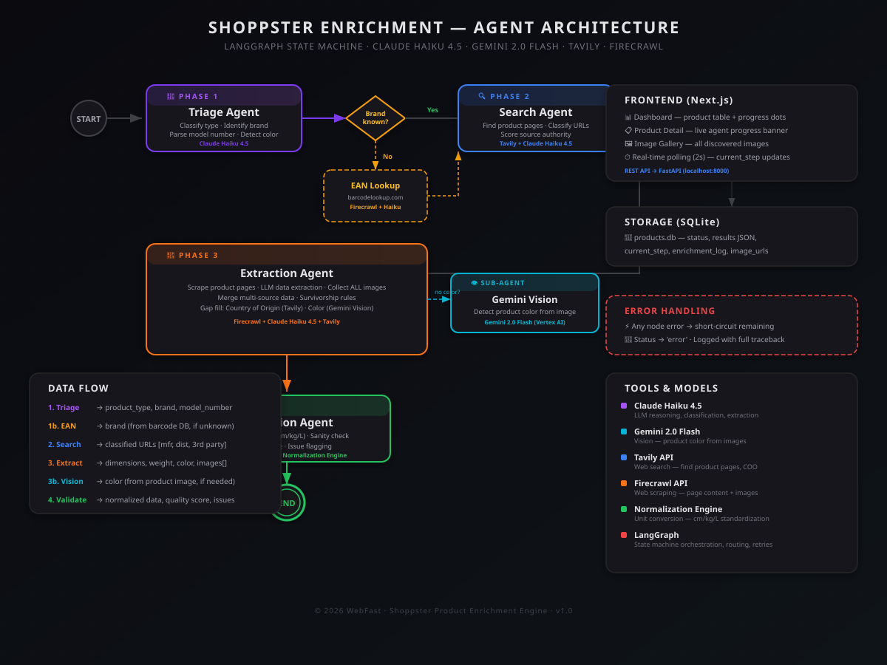

# Product Data Enrichment Engine

AI-powered product data enrichment platform built with **LangGraph** for orchestration, **Claude Haiku 4.5** for reasoning, **Tavily** for web search, and **Firecrawl** for web scraping.

Takes incomplete product data (EAN, name) and enriches it with dimensions, weight, color, country of origin, and images from authoritative web sources — manufacturer sites first, distributors as fallback, third-party sites as a gap-fill safety net.

Built as a **multi-tenant SaaS** — each customer gets their own isolated instance (Docker container + PostgreSQL database) with a dedicated config, user accounts, and a full settings dashboard.

## Architecture



The pipeline follows a **scrape-once, extract-multiple-times** pattern: all scraped page content is cached by source tier. Main extraction runs on official and authorized sources only. If critical fields are still missing, the gap-fill agent reads the cached third-party pages and runs a targeted single-pass extraction — no re-scraping needed. Validation runs last, on the complete data.

```
triage → [ean_lookup?] → search → extract → gap_fill → validate → save_costs
```

### Pipeline Agents

| Agent | Model | Role | Tools |
|-------|-------|------|-------|
| **Triage** | Configurable | Classify product type, identify brand, parse name | Claude structured output |
| **EAN Lookup** | Configurable | Find brand from barcode database (conditional) | Firecrawl scrape |
| **Search** | Configurable | Find product pages, classify URLs by source type | Tavily search, Claude |
| **Extract** | Configurable | Scrape all tiers, cache markdown, extract from official + authorized | Firecrawl, Claude, DB cache |
| **Gemini Vision** | Gemini 2.0 Flash | Detect product color from image (fires if text extraction fails) | Vertex AI Vision |
| **Gap Fill** | Configurable | Targeted extraction of critical missing fields from cached pages | Claude (Mode A cached system prompt) |
| **Validate** | Configurable | Normalize units, sanity check, quality scoring on complete data | Claude, normalization engine |

> All "Configurable" models can be set to **Haiku** (fast & cheap) or **Sonnet** (smart & thorough) per pipeline phase via the Settings dashboard.

---

## SaaS Architecture

### Multi-Instance Deployment

Each customer runs as a separate Docker Compose stack with isolated resources:

```
/opt/enrichment/
├── shoppster/
│   ├── docker-compose.yml
│   ├── .env
│   └── config/company.json
├── merkur/
│   ├── docker-compose.yml
│   ├── .env
│   └── config/company.json
└── update-all.sh
```

### Per-Customer Configuration

Every customer gets a `company.json` config file controlling:

| Section | What it controls |
|---------|-----------------|
| **Source** | Search strategy (`official_first`, `any_source`, `official_only`), search provider, result limits, domain allow/block lists |
| **Pipeline** | Feature flags (EAN lookup, gap fill, Gemini vision), scrape limits |
| **Critical Fields** | Which missing fields trigger gap-fill (weight, dims, warranty, etc.) |
| **Language** | Primary languages, output language, color/country name mappings |
| **Cost & Limits** | Daily budget, product limit, batch size, market region |
| **LLM Models** | Model selection per pipeline phase (Haiku vs Sonnet) |
| **Brands** | Known brand list, brand-to-country-of-origin seeds |
| **Export** | Column overrides, optional cost/log columns |

All settings can be changed at runtime via the **Settings dashboard** — changes are stored in the database and override file defaults.

### Authentication

Built-in email/password authentication with JWT tokens:
- **Admin** role: full access (upload, process, settings, user management)
- **Viewer** role: read-only access (view products, analytics, export)

---

## Deploying a New Customer Instance

### Prerequisites

- A VPS with Docker and Docker Compose installed (e.g. Hetzner, ~8 EUR/mo)
- Google Cloud project with Vertex AI enabled
- API keys for Tavily and Firecrawl

### 1. Create customer directory

```bash
# On the VPS
mkdir -p /opt/enrichment/acme/config
cd /opt/enrichment/acme
```

### 2. Copy docker-compose.yml

```bash
cp /opt/enrichment/docker-compose.template.yml ./docker-compose.yml
```

### 3. Create the company config

Create `config/company.json` (see `backend/config/shoppster.json` or `backend/config/merkur.json` as examples):

```json
{
  "company_name": "Acme Corp",
  "company_slug": "acme",
  "source": {
    "strategy": "official_first",
    "search_provider": "tavily",
    "max_manufacturer_results": 5,
    "max_general_results": 7,
    "max_general_queries": 3,
    "max_total_results": 6,
    "trust_third_party_as_primary": false
  },
  "pipeline": {
    "enable_ean_lookup": true,
    "enable_gap_fill": true,
    "enable_gemini_vision": true,
    "max_pages_to_scrape": 5,
    "max_gap_fill_pages": 5
  },
  "cost": {
    "max_daily_cost_usd": 50.0,
    "daily_product_limit": 200,
    "max_batch_size": 50,
    "market_region": "Europe"
  },
  "llm": {
    "triage_model": "haiku",
    "search_model": "haiku",
    "extract_model": "haiku",
    "gap_fill_model": "haiku",
    "validate_model": "haiku"
  }
}
```

### 4. Create .env file

```bash
cp backend/env.template .env
# Edit with your real values:
nano .env
```

Key variables:
```env
COMPANY_CONFIG_PATH=config/company.json
DATABASE_URL=postgresql://enrichment:CHANGE_ME@db:5432/enrichment
VERTEX_PROJECT_ID=your-gcp-project-id
VERTEX_LOCATION=europe-west1
GOOGLE_APPLICATION_CREDENTIALS=service-account.json
TAVILY_API_KEY=tvly-xxx
FIRECRAWL_API_KEY=fc-xxx
JWT_SECRET=generate-with-openssl-rand-hex-32
API_PORT=8000
```

### 5. Copy credentials

```bash
cp /path/to/service-account.json ./service-account.json
```

### 6. Start the instance

```bash
docker compose up -d
```

### 7. Create the admin user

```bash
docker compose exec api python scripts/create_admin.py admin@acme.com SecurePassword123 "Admin Name"
```

### 8. Access the dashboard

Open `http://your-vps-ip:8000` — login with the admin credentials.

### Running multiple customers

Each customer runs on a different port. Set `API_PORT` in each customer's `.env`:

```
# shoppster/.env
API_PORT=8000

# merkur/.env
API_PORT=8001

# acme/.env
API_PORT=8002
```

### Updating all instances

```bash
# Pull latest image and restart all customer stacks
docker pull ghcr.io/YOUR_USER/enrichment-engine:latest
for dir in /opt/enrichment/*/; do
  if [ -f "$dir/docker-compose.yml" ]; then
    cd "$dir" && docker compose up -d --pull always
  fi
done
```

---

## Local Development

### Prerequisites

- **Node.js** 18+ and npm
- **Python** 3.11+
- **Google Cloud** project with Vertex AI API enabled
- **API Keys** for Tavily and Firecrawl

### Credentials Setup

#### Google Cloud (Vertex AI — for Claude)

1. Create a Google Cloud project or use an existing one
2. Enable the **Vertex AI API** in the Google Cloud Console
3. Enable **Claude models** via the Vertex AI Model Garden
4. Create a **service account** with the Vertex AI User role
5. Download the service account JSON key file and place it in `backend/`

```bash
# Set in backend/.env
VERTEX_PROJECT_ID=your-gcp-project-id
VERTEX_LOCATION=us-east5
GOOGLE_APPLICATION_CREDENTIALS=path/to/your-service-account.json
```

#### Tavily (Web Search)

1. Sign up at [tavily.com](https://tavily.com)
2. Get your API key — free tier: 1,000 searches/month

```bash
TAVILY_API_KEY=tvly-your-key-here
```

#### Firecrawl (Web Scraping)

1. Sign up at [firecrawl.dev](https://www.firecrawl.dev)
2. Get your API key — free tier: 500 credits

```bash
FIRECRAWL_API_KEY=fc-your-key-here
```

### Installation

#### Backend

```bash
cd backend
python -m venv venv

# Activate:
# Windows: venv\Scripts\activate
# macOS/Linux: source venv/bin/activate

pip install -r requirements.txt

# Copy env template and fill in your credentials
cp env.template .env
```

#### Frontend

```bash
npm install
```

### Running Locally

```bash
# Terminal 1 — Backend (port 8000)
cd backend
python -m uvicorn main:app --host 0.0.0.0 --port 8000 --reload

# Terminal 2 — Frontend (port 3000)
npm run dev
```

Open [http://localhost:3000](http://localhost:3000) in your browser.

> For local development, the backend uses SQLite by default (no `DATABASE_URL` needed). Set `COMPANY_CONFIG_PATH=config/shoppster.json` to load a specific config, or it will use platform defaults.

---

## Usage

1. **Login** — Navigate to the app and login with your credentials
2. **Upload CSV/XLSX** — Click "Upload" on the dashboard. CSV needs at minimum `EAN` and `Name` columns
3. **Select products** — Check the products you want to enrich in the table
4. **Run enrichment** — Click "Run Enrichment" in the floating action bar, or "Process All" to enrich all pending products
5. **Watch agents work** — The table shows real-time progress: which agent is active, what step it's on, and pipeline progress dots
6. **Review results** — Click any product row to see the full detail view with enrichment log, extracted data, and validation report
7. **Export** — Download enriched data as XLSX from the product detail page or export all from the dashboard
8. **Settings** — Click your avatar in the top-right corner to access the Settings dashboard where you can tune all pipeline behavior

---

## Project Structure

```
├── app/                        # Next.js pages
│   ├── page.tsx                # Dashboard (product table, upload, batch actions)
│   ├── login/page.tsx          # Login page
│   ├── settings/page.tsx       # Settings dashboard (8 config sections)
│   ├── analytics/page.tsx      # Analytics & cost tracking
│   └── products/[id]/page.tsx  # Product detail page
├── components/
│   ├── UploadCSV.tsx           # File upload with drag-and-drop
│   ├── UserMenu.tsx            # Avatar dropdown (settings, analytics, logout)
│   ├── AuthGuard.tsx           # Route protection wrapper
│   └── ui/                    # ShadCN UI components
├── lib/
│   ├── api.ts                  # API client with JWT auth
│   ├── auth.tsx                # Auth context provider
│   └── sse.ts                  # SSE client with auth support
├── backend/
│   ├── main.py                 # FastAPI routes (all protected with JWT auth)
│   ├── graph.py                # LangGraph state machine
│   ├── db.py                   # Database access layer (SQLAlchemy compat wrapper)
│   ├── schemas.py              # Pydantic models
│   ├── config/
│   │   ├── schema.py           # CompanyConfig Pydantic schema (all settings)
│   │   ├── loader.py           # Config loader (file + DB override)
│   │   ├── shoppster.json      # Shoppster customer config
│   │   └── merkur.json         # Merkur customer config
│   ├── auth/
│   │   ├── router.py           # Auth API (login, register, me, change-password)
│   │   ├── security.py         # bcrypt + JWT
│   │   └── dependencies.py     # FastAPI auth dependencies
│   ├── settings/
│   │   └── router.py           # Settings API (GET/PUT/DELETE config overrides)
│   ├── database/
│   │   ├── models.py           # SQLAlchemy ORM models
│   │   └── session.py          # DB engine + session management
│   ├── pipeline/
│   │   ├── triage.py           # Phase 1: Classification agent
│   │   ├── search.py           # Phase 2: Search agent
│   │   ├── extract.py          # Phase 3: Extraction agent
│   │   ├── gap_fill.py         # Phase 4: Gap-fill agent
│   │   └── validate.py         # Phase 5: Validation agent
│   ├── utils/
│   │   ├── llm.py              # Anthropic Vertex AI + prompt caching
│   │   ├── gemini_vision.py    # Gemini 2.0 Flash color detection
│   │   ├── ean_lookup.py       # Barcode lookup
│   │   ├── normalization.py    # Unit conversion
│   │   └── cost_tracker.py     # Per-product cost accounting + guardrails
│   ├── scripts/
│   │   ├── create_admin.py     # Seed initial admin user
│   │   └── migrate_sqlite_to_postgres.py  # One-time SQLite → Postgres migration
│   ├── Dockerfile              # Production container image
│   └── env.template            # Environment variable template
├── docker-compose.yml          # Docker Compose template (API + Postgres)
├── SAAS_MIGRATION_PLAN.md      # Full migration plan with phase-by-phase prompts
└── README.md
```

---

## API Endpoints

### Auth
| Method | Endpoint | Auth | Description |
|--------|----------|------|-------------|
| POST | `/api/auth/login` | None | Login, returns JWT token |
| POST | `/api/auth/register` | Admin | Create new user |
| GET | `/api/auth/me` | Any | Current user info |
| POST | `/api/auth/change-password` | Any | Change own password |

### Products
| Method | Endpoint | Auth | Description |
|--------|----------|------|-------------|
| GET | `/api/products` | Any | List all products |
| GET | `/api/products/{id}` | Any | Get product detail |
| POST | `/api/upload` | Admin | Upload CSV/XLSX |
| POST | `/api/products/process-all` | Admin | Enrich all pending |
| POST | `/api/products/{id}/enrich` | Admin | Enrich single product |
| POST | `/api/products/{id}/reset` | Admin | Reset product to pending |
| GET | `/api/export` | Any | Export all as XLSX |

### Settings
| Method | Endpoint | Auth | Description |
|--------|----------|------|-------------|
| GET | `/api/settings` | Any | Get effective config (file + DB overrides) |
| PUT | `/api/settings` | Admin | Update a setting (stored in DB) |
| DELETE | `/api/settings/{key}` | Admin | Reset setting to file default |

### Analytics & SSE
| Method | Endpoint | Auth | Description |
|--------|----------|------|-------------|
| GET | `/api/dashboard/stats` | Any | Dashboard statistics |
| GET | `/api/dashboard/cost-stats` | Any | Cost analytics |
| GET | `/api/dashboard/limits` | Any | Current guardrail limits |
| GET | `/api/sse/products` | Any | SSE stream for all products |
| GET | `/api/sse/products/{id}` | Any | SSE stream for single product |

---

## Cost Optimization

### Prompt Caching (Anthropic)

All Claude API calls use Anthropic's prompt caching:

- **Mode A**: System prompts + schemas cached across products within 5-min TTL — 90% savings on cached prefix
- **Mode B**: Scraped markdown in system message, cached between extraction passes — Pass 2 gets a cache hit

### Scraped Pages Cache

All scraped page markdown is cached in the database by `product_id + url + source_type`. The gap-fill agent reads cached third-party pages without re-scraping.

### Cost Estimates

Per product (with prompt caching enabled):

| Service | Usage | Est. Cost |
|---------|-------|-----------|
| Tavily | 1-3 searches | $0.008-0.024 |
| Firecrawl | 4-8 scrapes | $0.003-0.006 |
| Claude Haiku 4.5 | 4-6 LLM calls | $0.005-0.015 |
| Claude Haiku 4.5 | 0-3 gap fill calls | $0.000-0.009 |
| Gemini Flash | 0-1 vision call | $0.000-0.001 |
| **Total** | | **$0.02-0.06** |

---

## Tech Stack

| Component | Technology |
|-----------|-----------|
| Frontend | Next.js 16, TypeScript, Tailwind CSS, ShadCN UI |
| Backend | Python 3.11+, FastAPI, SQLAlchemy |
| Database | PostgreSQL (production), SQLite (local dev) |
| Auth | bcrypt + JWT (built-in) |
| Orchestration | LangGraph (state machine) |
| LLM (Text) | Claude Haiku/Sonnet via Google Vertex AI |
| LLM (Vision) | Gemini 2.0 Flash via Google Vertex AI |
| Search | Tavily API |
| Scraping | Firecrawl API |
| Deployment | Docker Compose (per-customer instance) |
| CI/CD | GitHub Actions → GitHub Container Registry |
